Draft Version. Updated: March 7, 2018

Introduction
============

This lab walks you through the steps to get started using the Oracle
Autonomous Data Warehouse Cloud. You will provision a new ADWC database,
connect to the database using Oracle SQL Developer, and create DW users.

This is an instructor led lab, please follow the instructor before doing
the exercises. Stop and wait for the instructor led discussion after
each section before going to the next section.

This lab shows you only the functional aspects of ADWC. It does not have
exercises to test the performance of ADWC as the lab environment is not
running on Exadata.

Objectives
==========

-   Learn how to provision an ADWC service

-   Learn how to connect to ADWC

-   Learn how to create users in ADWC

Provisioning an ADWC Service
============================

### **STEP 1**: Go to <https://abcd.oracle.com>. Enter &lt;account name&gt; in the **Cloud Account Name** field and click **My Services**.

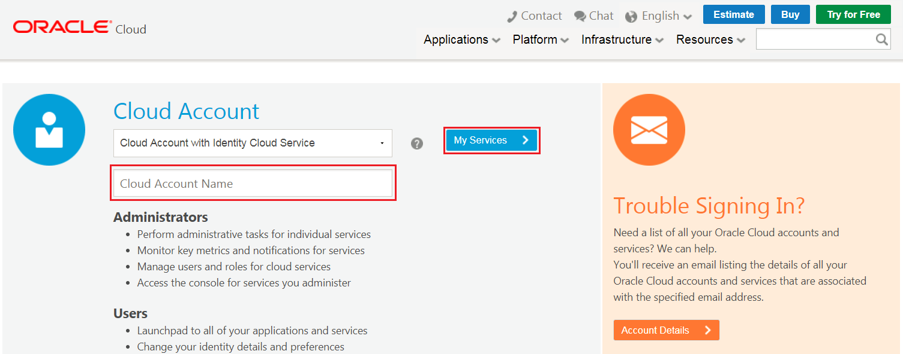

### **STEP 2**: Log in with the following account

**Username**: &lt;username&gt;

**Password**: &lt;password&gt;

### **STEP 3**: Click the **Menu Action** icon and select **Open Service Console**

### **STEP 4**: On the Instances page, click **Create Instance**.

### **STEP 5**: In the first page of the Create New Instance wizard, enter the following information:

-   **Database Name** - &lt;yourname&gt;dw. &lt;&lt;Prefix your database
    name with a unique name (you can use your name, for example), e.g.
    JackDW. Since all users will be using the same cloud account, it is
    important that you use a unique database name.

-   **CPU Count** - 2 &lt;&lt; Do not use more than 2 as it may cause
    other users not being able to provision as the training environment
    can only host a small number of CPUs.

-   **Storage Capacity (TB)** - 1

-   **Administrator Password** – &lt;password&gt;

Click **Next**.

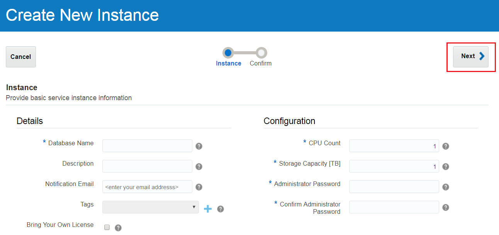

### **STEP 6**: In the second page of the Create New Instance wizard, confirm your entries and click **Create**. The Create New Instance wizard closes.

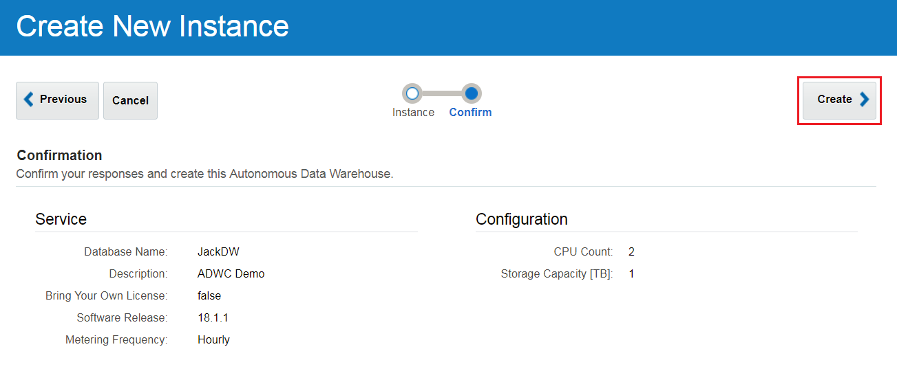

### **STEP 7**: On the Instances page, the Status field indicates the service instance is being created. When creation is completed, the Status field disappears. You can click the refresh button to see the latest creation status.

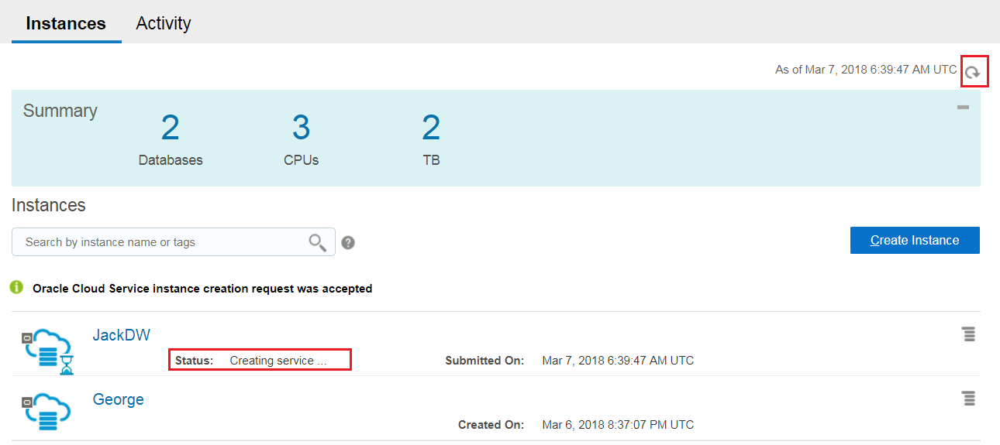

Connecting to ADWC
==================

Downloading the credentials wallet
----------------------------------

As ADWC only accepts secure connections to the database, you need to
download a wallet file containing your credentials first. The wallet is
downloaded from the ADWC service console.

### **STEP 1**: In the services screen find your database and click “Service Console” in the actions menu.

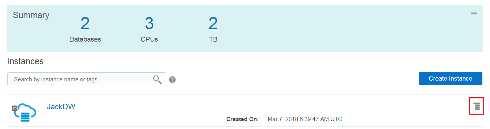

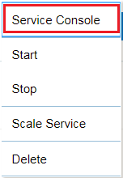

### **STEP 2**: Login to the service console with the following information.

**Username:** admin

**Password:** &lt;password&gt; &lt;&lt;The administrator password you
specified during provisioning

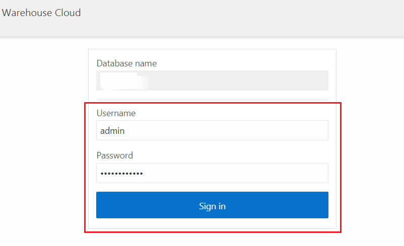

### **STEP 3**: The service console opens in the Overview mode. Click the **Administration** tab.

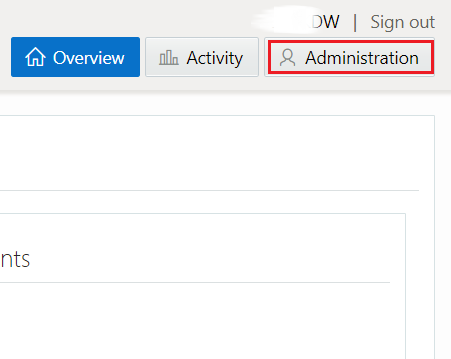

### **STEP 4**: Click **Download Client Credentials**.

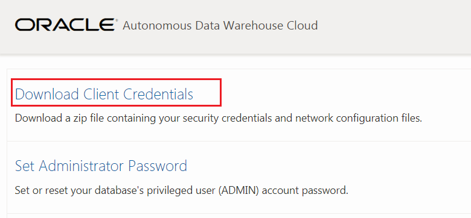

### **STEP 5**: You are prompted to create a password for the credentials zip file. Enter a password **&lt;password&gt;** and click **Download**.

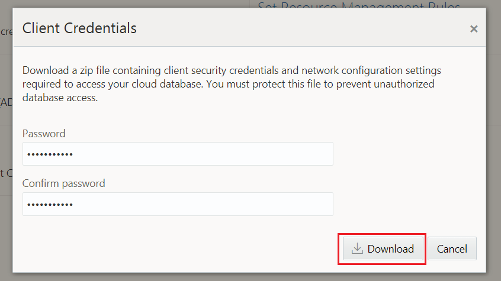

Store the zip file and make note of the password. You will use the zip
file and password in the next step to define a SQL Developer connection
to your Autonomous DW Cloud database.

Connecting to the database using SQL Developer
----------------------------------------------

Start SQL Developer and create a connection for your database using the
default administrator account, ADMIN, by following these steps.

### **STEP 1**: Start Oracle SQL Developer 

### **STEP 2**: Click the **Create Connection** icon in the Connections toolbox on the top left of the SQL Developer homepage.

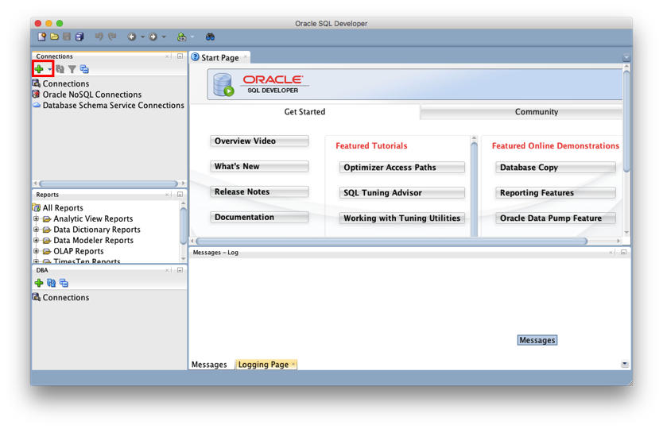

### **STEP 3**: Fill in the connection details as below:

**Connection Name**: admin

**Username**: admin

**Password**: &lt;password&gt;       &lt;&lt; The password you specified
during provisioning

**Connection Type**: Cloud PDB

**Configuration File**: Enter the full path for the wallet file you
downloaded before, or click the Browse button to point to the location
of the file.

**Keystore Password**: &lt;password&gt; &lt;&lt;&lt; The password you
specified when downloading the wallet from the ADWC service console

**Service**: There are 3 pre-configured database services for each
database. Pick &lt;databasename&gt;\_high for this lab. For example, if
you created a database named JackDW select jackdw\_high as the service.
As all lab attendees are using the same PSM tenant you will see all
services for all users in this list, pick the one belonging to your
database.

**Note**: Earlier versions of SQL Developer may not support this
feature.

### **STEP 4**: Click **Test**. 

Status: Success displays at the left-most bottom of the New/Select
Database Connection dialog.

### **STEP 5**: Click **Connect**. 

An entry for the new connection appears under Connections.

 
=

Creating users in ADWC
======================

Using your existing connection in SQL Developer, create a new user named
SH using the following commands.

**STEP 1**: Copy and paste the following commands to SQL Developer
worksheet

create user sh identified by "&lt;password&gt;";

grant dwrole to sh;

ADWC uses the password complexity function ora12c\_verify\_function, so
you need to use a strong password for your users.

Note that the database role DWROLE includes the privileges required by a
typical DW developer. You can grant additional database privileges if
needed.

**STEP 2**: Click the **Run Scripts** button above.
