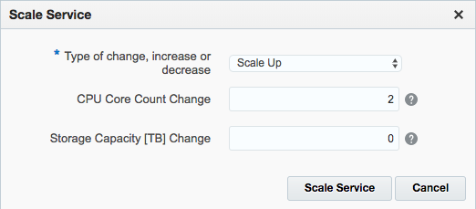
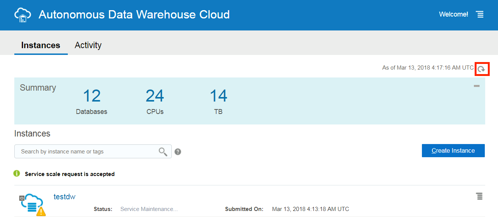
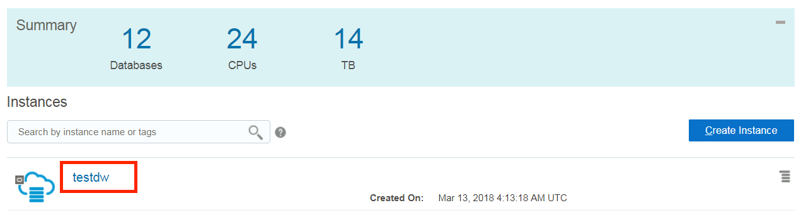

Draft Version. Updated: March 14, 2018

# ADWC Lab 300: Data Loading

## Introduction

In this section of the lab, you will be creating sample tables, loading data into them from files on the Oracle Cloud Infrastructure (OCI) Object Storage, and troubleshooting data loads with errors.

## Objectives

-   Learn how to create tables in your database

-   Learn how to load data from the Object Store

-   Learn how to troubleshoot data loads

## Required Artifacts

-   The following lab requires an Oracle Public Cloud account. You may your own cloud account, a cloud account that you obtained through a trial, or a training account whose details were given to you by an Oracle instructor.

-   Sample data files already uploaded to a staging area; otherwise follow the steps below, to upload your data files to the OCI Object
    Storage service:

    -   Click
        [here](https://github.com/oracle/db-sample-schemas/tree/master/sales_history) to download the sample data files to your laptop

    -   Upload the data to the OCI Object Storage
        ([link](https://docs.us-phoenix-1.oraclecloud.com/Content/GSG/Tasks/addingbuckets.htm) of documentation)

-   Oracle SQL Developer (see [Oracle Technology Network download site](http://www.oracle.com/technetwork/developer-tools/sql-developer/overview/index.html)).
    We recommend that you download version 17.4 or later, because this version contains enhancements for key Autonomous DW Cloud features. SQL Developer 17.3.1 will also work with Autonomous DW Cloud; versions earlier than 17.3.1 will not.\
    **Note**:\
    If you are a Windows user on 64-bit platform, download the 'Windows 64-bit with JDK 8 included' distribution as it includes both Java 8 and the Java Cryptography Extension (JCE) files necessary to run SQL Developer and connect to your Autonomous DW Cloud.\
    If you are a non-Windows user, download and install the appropriate [Java 8 JDK](http://www.oracle.com/technetwork/java/javase/downloads/jdk8-downloads-2133151.html) for your Operating System. Download and extract the [Java Cryptography Encryption Archive](http://www.oracle.com/technetwork/java/javase/downloads/jce8-download-2133166.html) to the directory as indicated in the README.txt.

# Create the tables

### STEP 1: Create Target Tables for Data Loading
---------------------------------------------

-   Connected as your user in SQL Developer, copy and paste [this code snippet](create_tables.txt) to SQL Developer worksheet. Take a
    moment to examine the script. Then click the **Run Script** button to run it as your user in SQL Developer.

    

Note that you do not need to specify anything other than the list of columns when creating tables in the SQL scripts. Also note that all the constraints are created as RELY DISABLE VALIDATE.

# Load data from the Object Store

### STEP 2: Creating an Object Store Swift Password

To load data from the Oracle Cloud Infrastructure(OCI) Object Storage you will need a Cloud user with the appropriate privileges to read data (or upload) data to the Object Store. The communication between the database and the object store relies on the Swift protocol and username/password authentication.

**Note:** If you are in an Oracle instructor-led workshop, setting up the object store will be demonstrated by the instructor for this
exercise. A user with the right setup has been pre-created for you to use.

-   Sign in to your Oracle Cloud Infrastructure Console with the following credentials provided by your Oracle Cloud: cloud tenant,
    user name, and password.

-   In the top-right corner of the Console, click the **username**, and then click **User Settings** to view the details. In this example, the user name is **tenant2**.

    **Note:** If you're an administrator creating a Swift password for another user: In the Console, click Identity, and then click Users. Locate the user in the list, and then click the user's name to view the details.

-   On the left side of the page, click **Swift Passwords**.

-   Click **Generate Password**.

-   Enter a friendly **description** for the password and click **Generate Password**.
    

-   The new Swift password is displayed. Click **Copy** to copy the Swift password for your records immediately, because you can't
    retrieve it again after closing the dialog box.
    

**Note:** If you're an administrator creating a Swift password for another user, you need to securely deliver it to the user by providing it verbally, printing it out, or sending it through a secure email service.

### STEP 3: Create a Database Credential for Your User

In order to access data in the Object Store you have to enable your database user to authenticate itself with the Object Store using your object store account and Swift password. You do this by creating a private CREDENTIAL object for your user that stores this information encrypted in your Autonomous Data Warehouse. This information is only usable for your user schema.

-   Connected as your user in SQL Developer, copy and paste [this code snippet](create_credential.txt) to SQL Developer worksheet.

    Specify the credentials for your Oracle Cloud Infrastructure Object Storage service: The **username** and the object store **Swift
    password** you generated in the previous step.
    

<!-- -->

-   Click the **Run Script** button to run the script.

-   Now you are ready to load data from the Object Store.

### STEP 4: Loading data using the data import wizard in SQL Developer

**Note:** Beginning with SQL Developer 18.1 the data import wizard supports loading from files in the Object Store straight into your
Autonomous Data Warehouse. This release of SQL Developer is going to be available soon, so for now this demo will be shown by the Oracle
instructor. After that demo you can continue with the “Loading data using the new PL/SQL package, DBMS\_CLOUD” section to load data using PL/SQL.

-   Expand ‘**Tables**’ in your user schema object tree. You will see all the tables you have created previously. Select table
    **CHANNELS**. Clicking the right mouse button opens the context-sensitive menu in SQL Developer; select ‘**Import Data**’:

-   The Data Import Wizard is started. Enter the following information:

    -   Select **Oracle Cloud Storage** as source for the data load

    -   Enter the following URI as the file to load:
        https://swiftobjectstorage.us-ashburn-1.oraclecloud.com/v1/dwcsdemo/DEMO\_DATA/channels.csv

    -   Select the Credential you previously created for authentication with the Object Store, **OBJ\_STORE\_CRED**

After entering this information, you can preview the data and select the appropriate file formats. You will see that the data preview is
interactive and changes according to your selection.

When you are satisfied with the file content view, click NEXT.

-   Here you control the import method and parameters. Since we invoked the data import wizard for table CHANNELS the only load method is a direct load into this table. Click NEXT.

-   The column definition screen shows you whether the sample data violates any of the existing column definitions of table CHANNELS
    (for a load into a new table you would select the column names and data types for the new table). Click NEXT.

-   The last screen before the final data load enables you to test a larger row count than the sample data of the beginning of the wizard to see whether the previously made decisions are satisfying for your data load. Note that we are not loading any data when iterating back and forth between this screen and previous ones. Select **TEST RESULTS** and look at the log, the data you would load, any mistakes and how the external table definition looks like based on your inputs.

When done with your investigation, click **NEXT**.

-   The final screen reflects all your choices made in the Wizard. Click **FINISH** to load the data into table CHANNELS.

### STEP 5: Loading data using the new PL/SQL package, DBMS\_CLOUD

Alternative to the wizard-guided data load you can use the PL/SQL package **DBMS\_CLOUD** directly. This is the preferred choice for any
load automation.

-   Connected as your user in SQL Developer, copy and paste [this code snippet](load_data.txt) to SQL Developer worksheet.

    Specify the parameters: **credential\_name** and **file\_uri\_list**.

    **Note:** If you are in an Oracle instructor-led workshop, the parameters have been specified for you. You can ran the SQL scripts
    as it is.

    -   For credential\_name, specify the name of the credential you defined in STEP 2: Create a Database Credential for Your User.

    -   For file\_uri\_list, specify the URL that points to the location of the file staged in the object store. The URL is structured as follows. The values you specify are in bold:

        https://swiftobjectstorage.&lt;**region name**&gt;.oraclecloud.com/v1/&lt;**tenant name**&gt;/&lt;**bucket name**&gt;/&lt;**file name**&gt;

-   Click the **Run Script** button to run the script.

-   You have successfully loaded the sample tables. Now, you can run any sample query in the [*relational analytics*](https://docs.oracle.com/database/122/DWHSG/part-relational-analytics.htm#DWHSG8493) section of the Oracle documentation. For example, to analyze the cumulative amount sold for specific customer IDs in quarter 2000, you could run the query in [this code snippet](query_tables.txt). ([*link*](https://docs.oracle.com/database/122/DWHSG/sql-analysis-reporting-data-warehouses.htm#GUID-33B4DE75-D7F8-4AE1-9F2E-C2846F72CC1E__GUID-4CB0EE02-AA9F-42D9-8F1B-2CD477496CD9) to documentation).

### STEP 6: Troubleshooting data loads

-   Connected as your user in SQL Developer, run the following queries
    to look at past and current data loads.

> select \* from user\_load\_operations;

This table lists the past and current load operations in your schema.Any data copy and data validation operation will be automatically
tracked by Oracle.

-   To look at the log of a load operation, copy and paste [this code snippet](load_data_with_errors.txt) to a SQL Developer worksheet and run the script as your user in SQL Developer. Note that you are going to load the data with errors this time.

-   Run the following queries to see the load that errored out.

> select \* from user\_load\_operations where status='FAILED';

A load or external table validation that errors out is indicated by status=FAILED in this table. Get the names of the log and bad files for the failing load operation from the column **logfile\_table** and **badfile\_table**.

-   Query the log and bad tables to see detailed information about an individual load. In this example, the names are copy\$15\_log and
    copy\$15\_bad respectively.

-   You are now ready to move to the next lab.