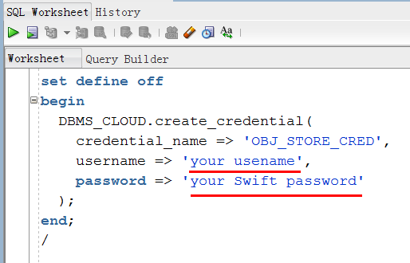
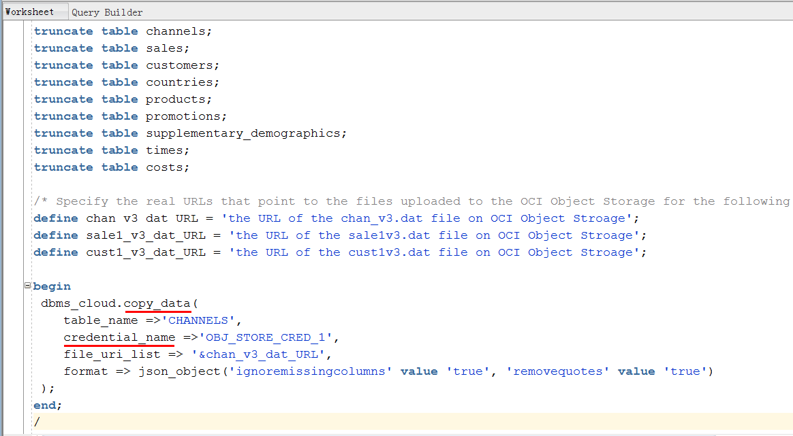
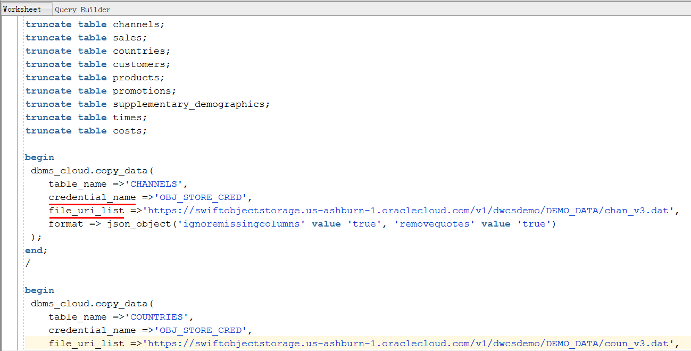
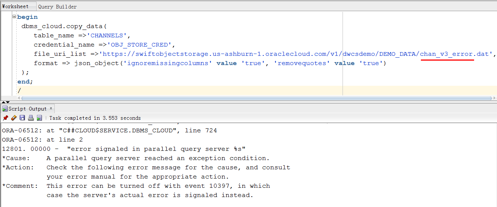

Draft Version. Updated: March 18, 2018

# ADWC Lab 300: Data Loading

## Introduction

In this section of the lab, you will be uploading files to the Oracle Cloud Innfrastructure (OCI) Object Storage, creating sample tables, loading data into them from files on the OCI Object Storage, and troubleshooting data loads with errors.

## Objectives

-   Learn how to upload files to the OCI Object Storage

-   Learn how to create tables in your database

-   Learn how to load data from the Object Store

-   Learn how to troubleshoot data loads

## Required Artifacts

-   The following lab requires an Oracle Public Cloud account. You may your own cloud account, a cloud account that you obtained through a trial, or a training account whose details were given to you by an Oracle instructor.

-   Oracle SQL Developer (see <a href="http://www.oracle.com/technetwork/developer-tools/sql-developer/overview/index.html" target="_blank">Oracle Technology Network download site</a>).
    We recommend that you download version 17.4 or later, because this version contains enhancements for key Autonomous DW Cloud features. SQL Developer 17.3.1 will also work with Autonomous DW Cloud; versions earlier than 17.3.1 will not.
    **Note**:
    If you are a Windows user on 64-bit platform, download the 'Windows 64-bit with JDK 8 included' distribution as it includes both Java 8 and the Java Cryptography Extension (JCE) files necessary to run SQL Developer and connect to your Autonomous DW Cloud.
    If you are a non-Windows user, download and install the appropriate <a href="http://www.oracle.com/technetwork/java/javase/downloads/jdk8-downloads-2133151.html" target="_blank">Java 8 JDK</a> for your Operating System. Download and extract the <a href="http://www.oracle.com/technetwork/java/javase/downloads/jce8-download-2133166.html" target="_blank">Java Cryptography Encryption Archive</a> to the directory as indicated in the README.txt.

# Upload files to OCI Object Store
## Steps
### STEP 1: Download the sample data files to your local computer

-   For this lab, you will need a handful of data files.  Please click on the links and download them to a directory on your local computer:

    -   Sales data: <a href="https://raw.githubusercontent.com/oracle/db-sample-schemas/master/sales_history/sale1v3.dat" target="_blank">sale1v3.dat</a>
    -   Customer data: <a href="https://raw.githubusercontent.com/oracle/db-sample-schemas/master/sales_history/cust1v3.dat" target="_blank">cust1v3.dat</a>
    -   Channel data: <a href="https://raw.githubusercontent.com/oracle/db-sample-schemas/master/sales_history/chan_v3.dat" target="_blank">chan_v3.dat</a>
    -   Channel data (with intentional errors): <a href="files/chan_v3_error.dat" target="_blank">chan_v3_error.dat</a>
    -   Channel data (in CSV format): <a href="files/channels.csv" target="_blank">channels.csv</a>
    
### STEP 2: Navigate to the OCI Compute Console 

-   The easiest way to get to the OCI Compute Console is to first navigate to the My Services Dashboard page:
    

-   From the My Services Dashboard page, open the upper left menu and expand Services.  Under Services, click on the entry titled "Compute".  *Hint: you might want to right-click on Compute and choose "open in new tab" so that you can keep the My Services Dashboard open*:
    

-   This should take you to the OCI Compute Console:
    


### STEP 3: Navigate to the Storage Tab, then Object Storage 
To learn more about the OCI Object Storage, check out this <a href="https://docs.us-phoenix-1.oraclecloud.com/Content/GSG/Tasks/addingbuckets.htm" target="_blank">documentation</a> .

-   In the OCI Compute Console, click on the Storage tab, then click on Object Storage on the left-hand menu:
    

-   Choose the root compartment in the COMPARTMENT drop-down if it is not already choosen:
    

### STEP 4: Create a Bucket for the Object Storage
In OCI Object Storage, a bucket is the terminology for a container of multiple files. 

-   Click the Create Bucket button:
    

-   Name your bucket and click Create Bucket button.  *Hint: If you name your bucket ADWCLab, you won't need to edit the bucket name in the scripts you run later in the lab*:
    

### STEP 5: Upload files to your OCI Object Store Bucket

-   Click on your bucket name to open it:
    

-   Click on the Upload Object button:
    

-   Using the browse button or drag-and-drop select the **sale1v3.dat** file you downloaded earlier and click Upload Object:
    

-   Repeat this for the **cust1v3.dat**, **chan_v3.dat**, **chan_v3_error.dat**, and **channels.csv** files.

-   The end result should look like this with all 5 files listed under Objects:
    

### STEP 6: Construct the URLs of the Files on your OCI Object Storage
-   Construct the URL that points to the location of the chan_v3.dat file staged in the OCI Object Storage. The URL is structured as follows. The values for you to specify are in bold:


   https://swiftobjectstorage.<region name>.oraclecloud.com/v1/<tenant name>/<bucket name>/<file name>


In this example, the region name is us-ashburn-1, the tenant name is dbayard00, and the bucket name is ADWCLab. Yours might be different. So the URL of the chan_v3.dat file is:


    https://swiftobjectstorage.**us-ashburn-1**.oraclecloud.com/v1/**dbayard00**/**ADWCLab**/**chan_v3.dat**

    

-   **Repeat** this for the **cust1v3.dat**, **chan_v3.dat**, **chan_v3_error.dat**, and **channels.csv** files. 

-   **Save** the URLs you constructed to a note. We will use the URLs in the following steps.

# Create the tables
## Steps
### STEP 7: Create Target Tables for Data Loading

-   Connected as your user in SQL Developer, copy and paste <a href="./scripts/300/create_tables.txt" target="_blank">this code snippet</a> to SQL Developer worksheet. Take a moment to examine the script. Then click the **Run Script** button to run it.

    

Note that you do not need to specify anything other than the list of columns when creating tables in the SQL scripts. Also note that all the constraints are created as RELY DISABLE VALIDATE.

# Load data from the Object Store
## Steps
### STEP 8: Creating an Object Store Swift Password

To load data from the Oracle Cloud Infrastructure(OCI) Object Storage you will need a Cloud user with the appropriate privileges to read data (or upload) data to the Object Store. The communication between the database and the object store relies on the Swift protocol and username/password authentication.

**Note:** If you are in an Oracle instructor-led workshop, setting up the object store will be demonstrated by the instructor for this
exercise. A user with the right setup has been pre-created for you to use.

-   Go back to the OCI Compute Console in your browser. In the top menu, click the **Identity**, and then click **Users**. 
    

-   Click the **user's name** to view the details.
    

-   On the left side of the page, click **Swift Passwords**.
    

-   Click **Generate Password**.
    

-   Enter a friendly **description** for the password and click **Generate Password**.
    

-   The new Swift password is displayed. Click **Copy** to copy the Swift password for your records immediately, because you can't retrieve it again after closing the dialog box.
    

### STEP 9: Create a Database Credential for Your User

In order to access data in the Object Store you have to enable your database user to authenticate itself with the Object Store using your object store account and Swift password. You do this by creating a private CREDENTIAL object for your user that stores this information encrypted in your Autonomous Data Warehouse. This information is only usable for your user schema.

-   Connected as your user in SQL Developer, copy and paste <a href="./scripts/300/create_credential.txt" target="_blank">this code snippet</a> to SQL Developer worksheet.

    Specify the credentials for your Oracle Cloud Infrastructure Object Storage service: The **username** and the object store **Swift password** you generated in the previous step.
    

<!-- -->

-   Click the **Run Script** button to run the script.

    

-   Now you are ready to load data from the Object Store.

### STEP 10: Loading Data Using the Data Import Wizard in SQL Developer

**Note:** Beginning with SQL Developer 18.1 the data import wizard supports loading from files in the Object Store straight into your Autonomous Data Warehouse. **This release of SQL Developer is going to be available soon, so for now this step will be demonstrated by the Oracle instructor if you are in an Oracle instructor-led workshop**. After that demo you can continue with the next step "Loading data using the new PL/SQL package, DBMS\_CLOUD” to load data using PL/SQL.

-   Expand ‘**Tables**’ in your user schema object tree. You will see all the tables you have created previously. Select table **CHANNELS**. Clicking the right mouse button opens the context-sensitive menu in SQL Developer; select ‘**Import Data**’:

    
    

-   The Data Import Wizard is started. Enter the following information:

    -   Select **Oracle Cloud Storage** as source for the data load

    -   Enter the URL of channels.csv as the file to load. You constructed the URL in STEP 6. In this example, it is:
        https://swiftobjectstorage.us-ashburn-1.oraclecloud.com/v1/dwcsdemo/DEMO\_DATA/channels.csv

    -   Select the Credential you previously created for authentication with the Object Store, **OBJ\_STORE\_CRED**

After entering this information, you can preview the data and select the appropriate file formats. You will see that the data preview is
interactive and changes according to your selection.

When you are satisfied with the file content view, click **NEXT**.

    

-   Here you control the import method and parameters. Since we invoked the data import wizard for table CHANNELS the only load method is a direct load into this table. Click **NEXT**.

    

-   The column definition screen shows you whether the sample data violates any of the existing column definitions of table CHANNELS (for a load into a new table you would select the column names and data types for the new table). Click **NEXT**.

    

-   The last screen before the final data load enables you to test a larger row count than the sample data of the beginning of the wizard to see whether the previously made decisions are satisfying for your data load. Note that we are not loading any data when iterating back and forth between this screen and previous ones. Select **TEST RESULTS** and look at the log, the data you would load, any mistakes and how the external table definition looks like based on your inputs.

&nbsp;&nbsp;&nbsp;&nbsp;&nbsp;&nbsp;&nbsp;&nbsp;&nbsp;&nbsp;&nbsp;When done with your investigation, click **NEXT**.

    

-   The final screen reflects all your choices made in the Wizard. Click **FINISH** to load the data into table CHANNELS.

### STEP 11: Loading Data Using the New PL/SQL Package, DBMS_CLOUD

Alternative to the wizard-guided data load you can use the PL/SQL package **DBMS_CLOUD** directly. This is the preferred choice for any load automation.

-   Connected as your user in SQL Developer, copy and paste <a href="./scripts/300/load_data.txt" target="_blank">this code snippet</a> to SQL Developer worksheet. We use the **copy\_data** procedure of the **DBMS\_CLOUD** package to copy the data (**chan\_v3.dat**, **sale1v3.dat**, and **cust1v3.dat**) staged in your object store.
    -   For the **credential_name** parameter, it is the name of the credential you defined in the step of Create a Database Credential for Your User.
    
    -   For the **file_uri_list** parameter, it is assigned the value of the **chan\_v3\_dat\_URL** variable. Specify the URL that points to the **chan\_v3.data file** on your OCI Object Storage in the definition of the **chan\_v3\_dat\_URL** variable. You have constructed and saved the URL in the step of Construct the URLs of the Files on your OCI Object Storage. 
    

-   Repeat this for the **sale1\_v3\_dat\_URL** and **cust1\_v3\_dat\_URL** variables in the script.
    

-   Click the **Run Script** button to run the script.

-   You have successfully loaded the sample tables. Now, you can run any sample query in the <a href="https://docs.oracle.com/database/122/DWHSG/part-relational-analytics.htm#DWHSG8493" target="_blank">relational analytics</a> section of the Oracle documentation. For example, to analyze the cumulative amount sold for specific customer IDs in quarter 2000, you could run the query in <a href="./scripts/300/query_tables.txt" target="_blank">this code snippet</a>. ( <a href="https://docs.oracle.com/database/122/DWHSG/sql-analysis-reporting-data-warehouses.htm#GUID-33B4DE75-D7F8-4AE1-9F2E-C2846F72CC1E__GUID-4CB0EE02-AA9F-42D9-8F1B-2CD477496CD9" target="_blank">link</a> to documentation).

    

### STEP 12: Troubleshooting data loads

-   Connected as your user in SQL Developer, run the following queries
    to look at past and current data loads.
```
select * from user_load_operations;
```
This table lists the past and current load operations in your schema.Any data copy and data validation operation will be automatically
tracked by Oracle.

-   To look at the log of a load operation, copy and paste <a href="./scripts/300/load_data_with_errors.txt" target="_blank">this code snippet</a> to a SQL Developer worksheet and run the script as your user in SQL Developer. Specify the URL that points to the chan_v3.data file. You have constructed and saved the URL in the step of Construct the URLs of the Files on your OCI Object Storage. Note that you are going to load the data with errors this time.

    

-   Run the following queries to see the load that errored out.
```
select * from user_load_operations where status='FAILED';
```
    

A load or external table validation that errors out is indicated by status=FAILED in this table. Get the names of the log and bad files for the failing load operation from the column **logfile\_table** and **badfile\_table**. The LOGFILE_TABLE column shows the name of the table you can query to look at the log of a load operation. The column BADFILE_TABLE shows the name of the table you can query to look at the rows that got errors during loading.

-   Query the log and bad tables to see detailed information about an individual load. In this example, the names are copy$15_log and copy$15_bad respectively.

    

    

-   Keep your SQL Deveoper openned and move to the next lab - Querying External Data.