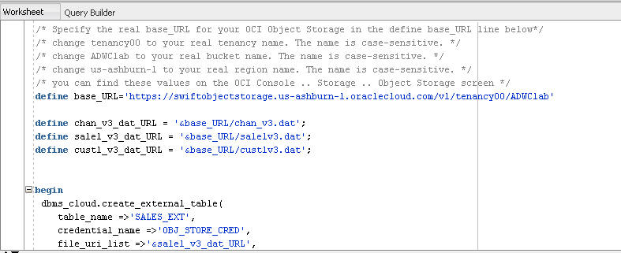
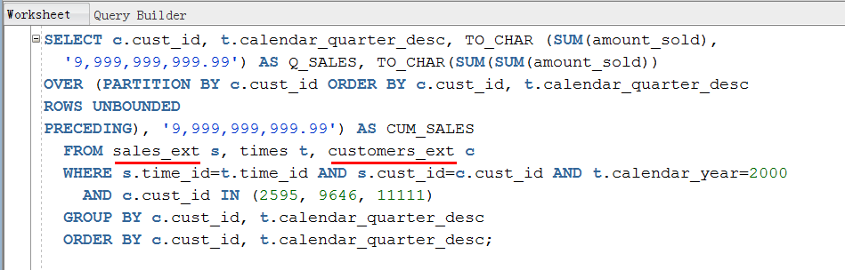
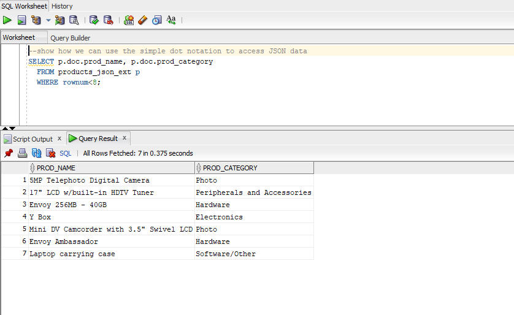
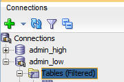
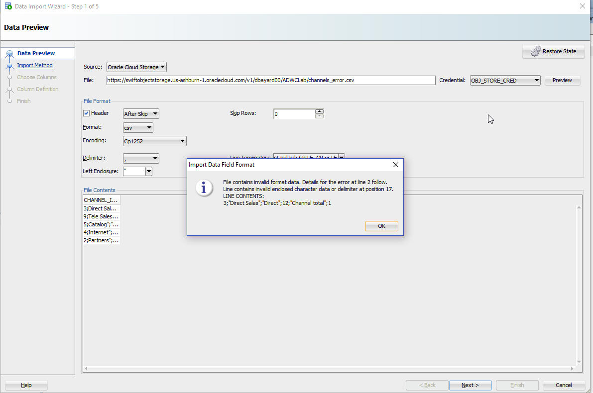
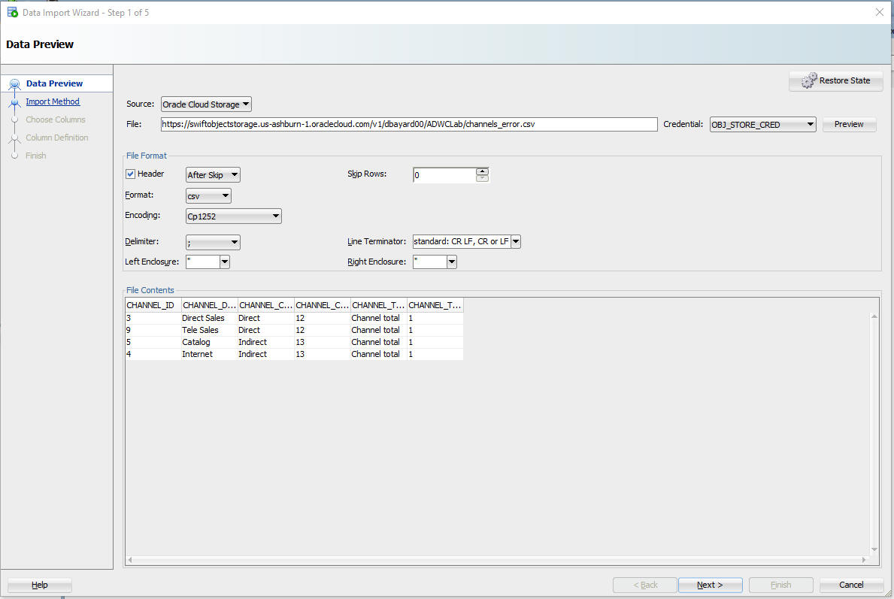
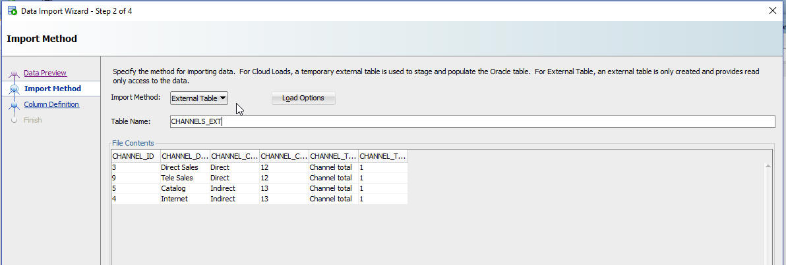
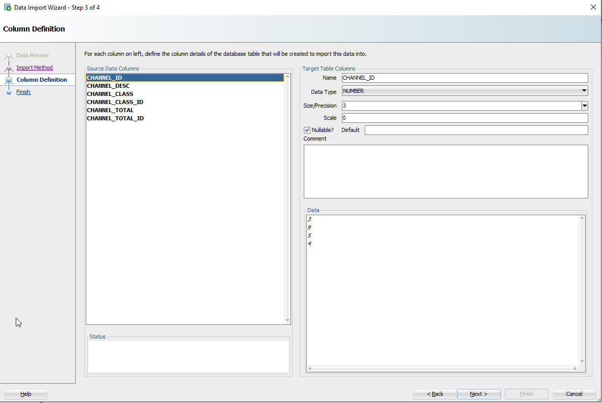
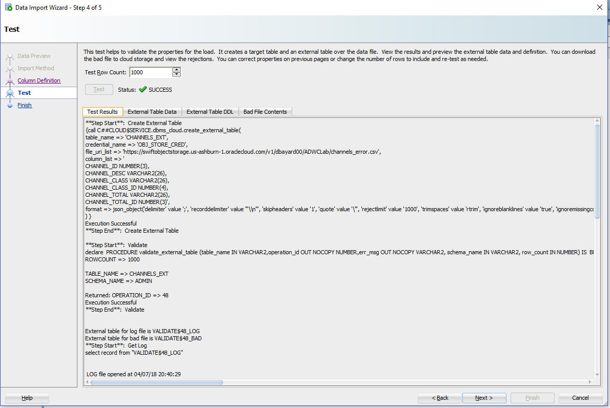
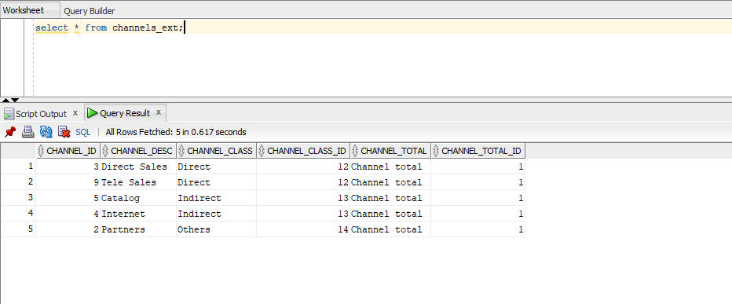

Updated: April 6, 2018

# ADWC Lab 400: Query External Data 

## Introduction

In this lab, you will be querying files on the Oracle Cloud Infrastructure Object Storage (OCI) directly without loading them to your database.

**Note:** Make sure you have completed <a href="https://millerhoo.github.io/journey4-adwc/workshops/journey4-adwc/LabGuide300.md" target="_blank">Lab 300: Loading Data</a> before you take this lab. Because you will use the data files on the OCI Object Storage and the credential object from Lab 300 in this lab.

To **log issues**, click [here](https://github.com/millerhoo/journey4-adwc/issues/new) to go to the github oracle repository issue submission form.

## Objectives

-   Learn how to create external tables on top of files residing on the object store

-   Learn how to query external data by the external tables

-   Learn how to create data warehouse user 

## Required Artifacts

-   The following lab requires an Oracle Public Cloud account. You may your own cloud account, a cloud account that you obtained through a trial, or a training account whose details were given to you by an Oracle instructor.

-   Oracle SQL Developer (see Lab100 for more specifics on the version of SQL Developer and how to install and configure it).

# Querying External Data

## Steps

### STEP 1: Create External Tables with DBMS_CLOUD

-   Connected as your user in SQL Developer, copy and paste <a href="./scripts/400/create_external_tables.txt" target="_blank">this code snippet</a> to SQL Developer worksheet.  

    Use the **create\_external\_table** procedure of the **DBMS\_CLOUD** package to create external tables on the files (**sales.csv.gz**, **customers.csv**, and **products.txt**) staged in your object store. Note that you are still using the same credential and the URLs of flies on OCI Object Storage you used when loading data in the previous lab.

    -   At the top of the script, specify the Object Store base URL in the definition of the **base\_URL** variable.
    


-   **Run the script**.

    Now you have external tables for the sample data pointing to files in the object store. Any query against the external tables will return the same result as against the original tables.

### STEP 2: Querying External Data

-   Copy and paste <a href="./scripts/400/query_external_data.txt" target="_blank">this code snippet</a> to SQL Developer worksheet. We only replaced the original table names <TABLE_NAME> with <TABLE_NAME_EXT> in the sample query.  
    

-   **Run the script**. It will return the same result as against the original tables.


### STEP 3: Exploring Oracle Database JSON features

-   Copy and paste <a href="./scripts/400/query_json_data.txt" target="_blank">this code snippet</a> to SQL Developer worksheet.
    

-   **Run the script**. It shows an example of querying json data stored on the Object Store using the Oracle Database's JSON features,  Learn more about JSON in the database <a href="https://docs.oracle.com/en/database/oracle/oracle-database/18/adjsn/json-in-oracle-database.html">here</a>.

### STEP 4: Creating an external table using the SQL Developer Import Wizard

-   Click on ‘**Tables**’ in your user schema object tree. Clicking the right mouse button opens the context-sensitive menu in SQL Developer; select ‘**Import Data**’:

    


-   The Data Import Wizard is started. Enter the following information:

    -   Select **Oracle Cloud Storage** as source for the data load

    -   Enter the URL of **channels_error.csv** as the file to load. You constructed the URL in data loading lab. For example, the URL might look something like:

        https://swiftobjectstorage.us-ashburn-1.oraclecloud.com/v1/dbayard00/ADWCLab/channels_error.csv

    -   Select the Credential you previously created for authentication with the Object Store, **OBJ\_STORE\_CRED**

    -   Click the **Preview** button

After clicking preview, you will likely get a warning about the format which we will fix next.



  - Now we will fix the file format settings.

     - Click OK to close the Invalid format window if you have not already.

     - Change the delimiter to the semicolon ;

The data should now look much better.




When you are satisfied with the data preview, click **NEXT**.

  - On the Import Method page, change the Import Method to External Table.

  - Define the table name as CHANNELS_EXT

  - Click **NEXT** to advance to the next page of the wizard.



  -   On the Column Definition page, you can control how the fields of the file map to columns in the table.  You can also adjust certain properties.

    - You should not need to change any column definitions, so click **NEXT**.



 


-   The last screen before the final data load enables you to test a larger row count than the sample data of the beginning of the wizard to see whether the previously made decisions are satisfying for your data load. Note that we are not loading any data when iterating back and forth between this screen and previous ones. Select **TEST RESULTS** and look at the log, the data you would load, any mistakes and how the external table definition looks like based on your inputs.

&nbsp;&nbsp;&nbsp;&nbsp;&nbsp;&nbsp;&nbsp;When done with your investigation, click **NEXT**.




-   The final screen reflects all your choices made in the Wizard. Click **FINISH** to create the external table CHANNELS_EXT.

-   Finally, test your new external table by running a query like this:

```
    select * from channels_ext;
```




### BONUS STEP: Create Data Warehouse User

-   Using your existing connection in SQL Developer, create a new user named **dwuser** using the following commands.
```
CREATE USER dwuser IDENTIFIED BY "Welcome_123!";
GRANT DWROLE to dwuser;
```
- Note that the database role DWROLE includes the privileges required by a typical DW developer. The privileges in DWROLE are the following. You can grant additional database privileges if needed.
```
CREATE ANALYTIC VIEW
CREATE ATTRIBUTE DIMENSION
ALTER SESSION
CREATE HIERARCHY
CREATE JOB
CREATE MINING MODEL
CREATE PROCEDURE
CREATE SEQUENCE
CREATE SESSION
CREATE SYNONYM
CREATE TABLE
CREATE TRIGGER
CREATE TYPE
CREATE VIEW
READ,WRITE ON directory DATA_PUMP_DIR
EXECUTE privilege on the PL/SQL package DBMS_CLOUD 
```

-   You are now ready to move to the next lab.

