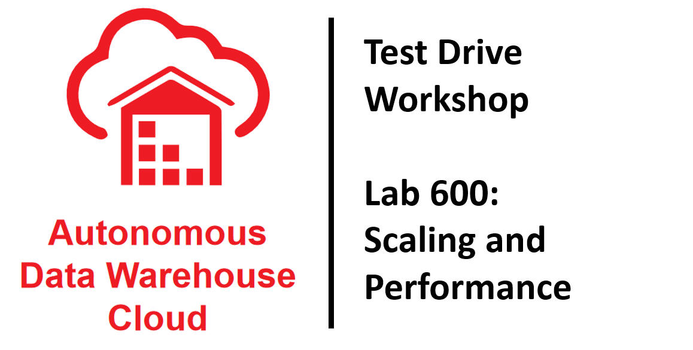
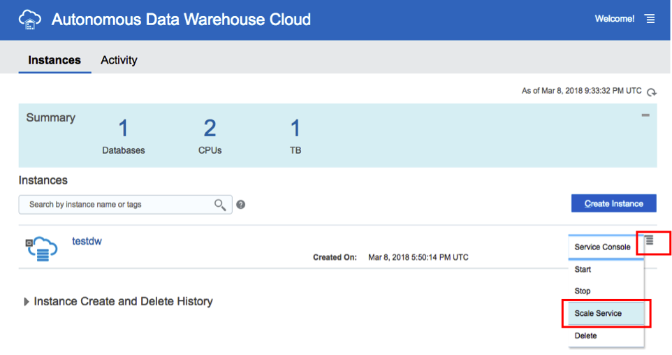
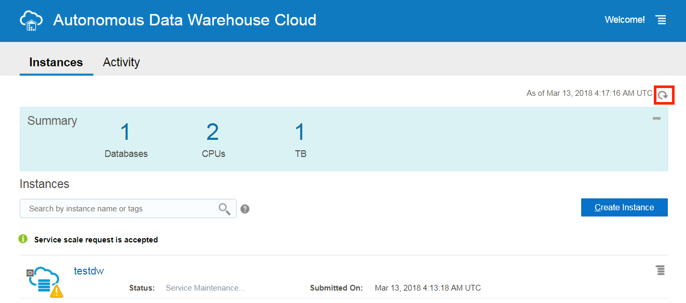
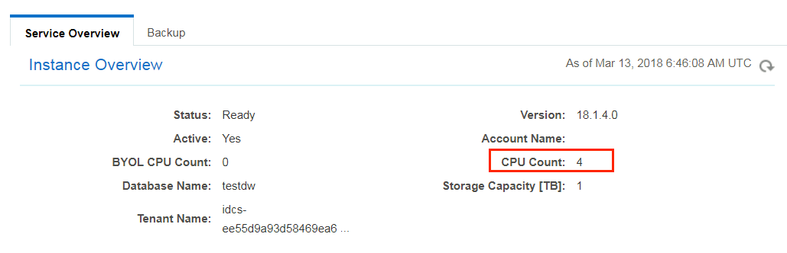

Draft Version. Updated: March 13, 2018

# ADWC Lab 600: Scaling and Performance

## Introduction

In this lab you will scale up your Oracle Autonomous Data Warehouse Cloud (ADWC) service to have more CPUs. And you will watch a demo that shows the performance and concurrency impacts of scaling your service online.

To **log issues**, click [here](https://github.com/millerhoo/journey4-adwc/issues/new) to go to the github oracle repository issue submission form.

## Objectives

-   Learn how to scale up an ADWC service

-   Understand the performance and concurrency impacts of scaling the ADWC service online

## Required Artifacts

-   The following lab requires an Oracle Public Cloud account. You may your own cloud account, a cloud account that you obtained through a trial, or a training account whose details were given to you by an Oracle instructor.

# Scaling and Performance Hands-on Lab

## Steps

### STEP 1: Scaling your ADWC instance

-   Go back to the Cloud Console you used during the provisioning exercise and open the Instances screen. Click the **action menu** and select **Scale Service**.

-   Fill in the form with the following information.

    -   **Type of change:** Scale Up

    -   **CPU core count change:** 2

    -   **Storage capacity change:** 0

> **Note** that these values are additional increments over existing CPU and storage capacity. By specifying 2 as CPU core count change, we will be adding 2 CPUs to the service.

Click **Scale Service** after filling in the form, this will take you the Instances screen.

> **Note** The applications can continue running during the scale operation without downtime.

-   **Refresh** the page to see the result of the scale operation.

-   **Click** on your database name and look at the Service Overview screen to see the new number of CPUs in your database.

### STEP 2: Performance and concurrency benefits of dynamic scaling

-   <a href="https://raw.githubusercontent.com/millerhoo/journey4-adwc/master/workshops/journey4-adwc/images/ADWC%20HOL%20-%20Scaling.mp4" target="_blank">Click here</a> to watch a demo of the performance impact of scaling up your instance. In the demo you will see that scaling up provides more concurrency for your users.

-   The demo will show a workload that has 10 concurrent users running with the MEDIUM database service. You will see that on a 2 CPU ADWC instance 5 queries are running whereas 5 queries are waiting in the queue for resources.

-   While the workload is running the database will be scaled up from 2 CPUs to 4 CPUs. You will see that the queries waiting in the queue are now able to start and there are no sessions waiting in the queue anymore.

-   ADWC allows you to dynamically scale your service online when you require more concurrency and performance.

