Updated: March 21, 2018

# Lab 700: Using Oracle Machine Learning Notebooks

## Introduction

During this lab you will be using the new Oracle Machine Learning (OML) notebook application provided with ADWC. This browser-based application provides a web interface to run SQL queries and scripts, which can be grouped together within a notebook. Notebooks can be used to build single reports, collections of reports, and dashboards. OML provides a simple way to share workbooks with other OML users.

## Objectives

-   Learn how to create OML Users
-   Learn how to run a SQL Statement
-   Learn how to share notebooks
-   Learn how to create and run SQL scripts

## Required Artifacts

-   The following lab requires an Oracle Public Cloud account. You may use your own cloud account, a cloud account that you obtained through a trial, or a training account whose details were given to you by an Oracle instructor.

# Creating OML Users

The first step is to create two new users.

## Steps

### Step 1: Creating OML Users

-   Go back to the Cloud Console and open the Instances screen. Find your database, click the action menu and select **Service Console**.

-   Log in to the service with your admin password.

-   Go to the **Administration** tab and click **Manage Oracle ML Users** to go to the OML user management page - this page will allow
    you to manage OML users.

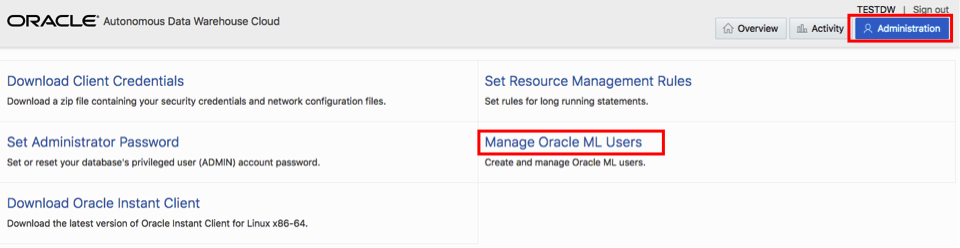

This will open a new tab within your browser that asks you for a username and password.

-   Enter **admin** as the username and use the password you specified when provisioning your ADWC instance.

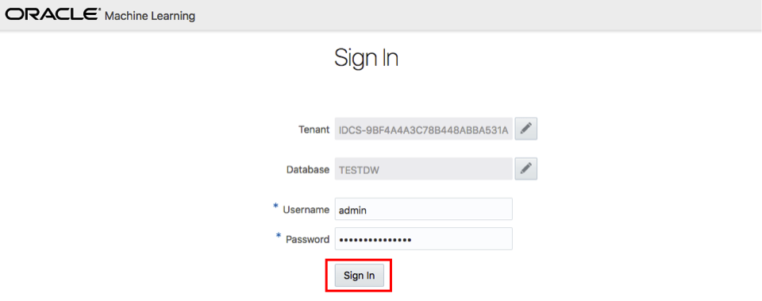

**Note** that you do not have to go to this page using the same steps every time, you can bookmark this Oracle ML Notebook Admin URL and access it directly later.

-   Click **Create** button to create a new OML user. Note that this will also create a new database user with the same name. This newly created user will be able to use the OML notebook application. Note that you can also enter an email address to send an email confirmation to your user (*for this lab you can use your own personal email address*) when creating the user.

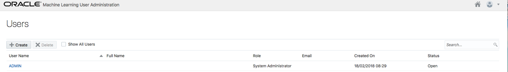

-   Enter the required information for this user, name the user as **omluser1**. If you supplied a valid **email address**, a welcome email should arrive within a few minutes to your Inbox. Click the **Create** button, in the top-right corner of the page, to create the user.

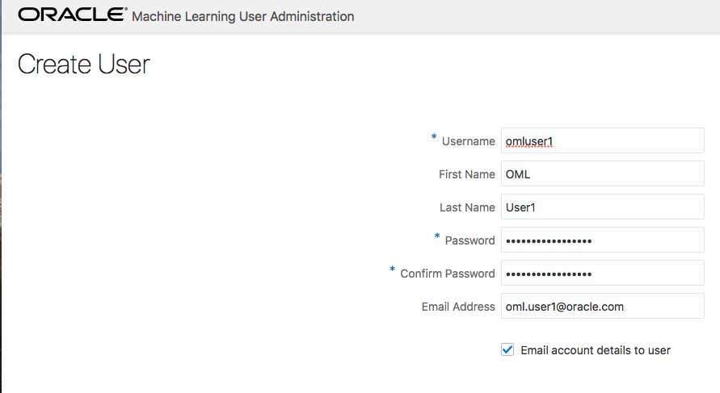

-   Below is the email which each user receives welcoming them to the OML application. It includes a direct link to the OML application
    for that user which they can bookmark.

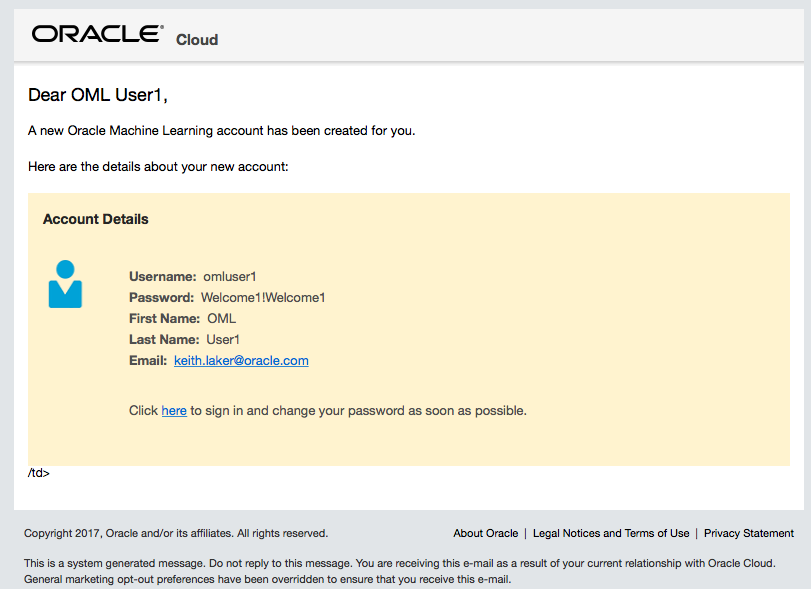

-   After you click **Create** you will see that user listed in the Users section.

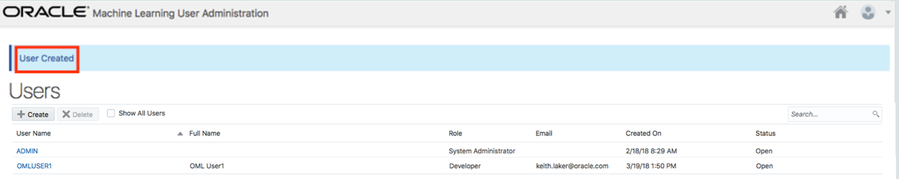

-   Using the same steps, create another user named **omluser2**.

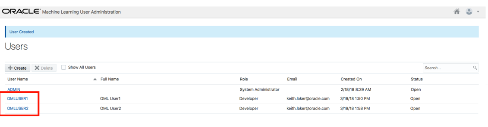

You will use these two users later in this workshop.

# Exploring the OML Home Page

## Steps

### Step 2: Signing into OML

-   Using the link from your welcome email, from Oracle Global Accounts, you can now sign-in to OML. Copy and paste the **application link** from the email into your browser and sign-in to OML.

**Note:** If you have not specified an email address you can click the Home icon on the top right of Oracle Machine Learning User administration page to go to OML home page.

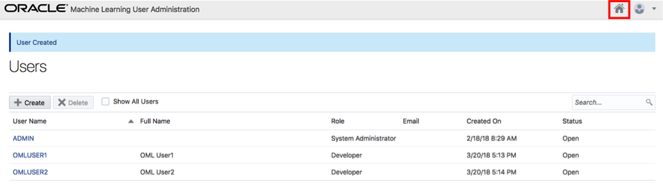

-   Use your new user account **omluser1**:

Once you have successfully signed in to OML the application home page will be displayed.

### Step 3: Overview of OML Home Page

-   The grey menu bar at the top of the screen provides links to the main OML menus for the application (left corner) and the
    workspace/project and user maintenance on the right-hand side.

-   On the home page the main focus is the “**Quick Actions**” panel. The main icons in this panel provide shortcuts to the main OML pages for running queries and managing your saved queries.

-   All your work is automatically saved – i.e. there is no “Save” button when you are writing scripts and/or queries.

### Step 4: Understanding the Key concepts

-   What is a Workspace?

    A workspace is an area where you can store your projects. Each workspace can be shared with other users so they can collaborate with you. For collaborating with other users, you can provide different levels of permission such as Viewer, Developer and Manager – these will be covered in more detail later in this lab. You can create multiple workspaces.

-   What is a Project?

    A project is a container for organizing your notebooks. You can create multiple projects.

-   What is a Notebook?

    A notebook is a web-based interface for building reports and dashboards using a series of pre-built data visualizations which can then be shared with other OML users. Each notebook can contain one or SQL queries and/or SQL scripts. Additional non-query information can be displayed using special markdown tags (an example of these tags will be shown later).

# Running a SQL Statement

## Steps

### Step 5: Opening a new SQL query scratchpad

-   From the home page click on the “**Run SQL Statement**” link in the Quick Actions panel to open a new SQL query scratchpad.

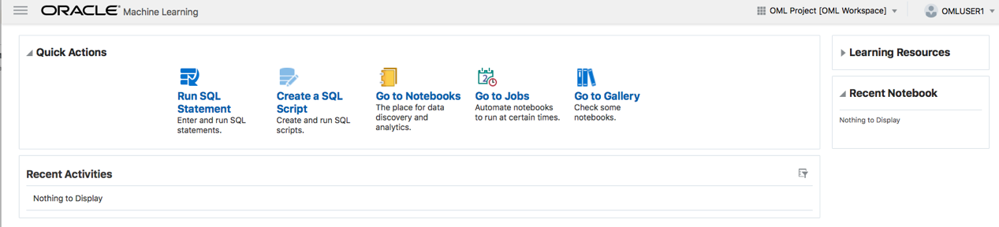

-   The following screen should appear:

-   The white panel below the main title (SQL Query Scratchpad – this name is automatically generated) is an area known as “paragraph”. Within a scratchpad you can have multiple paragraphs. Each paragraph can contain one SQL statement or a SQL script.

-   In the SQL paragraph area copy and paste <a href="./scripts/700/new_SQL_query_scratchpad.txt" target="_blank">this code snippet</a>. Your screen should now look like this:

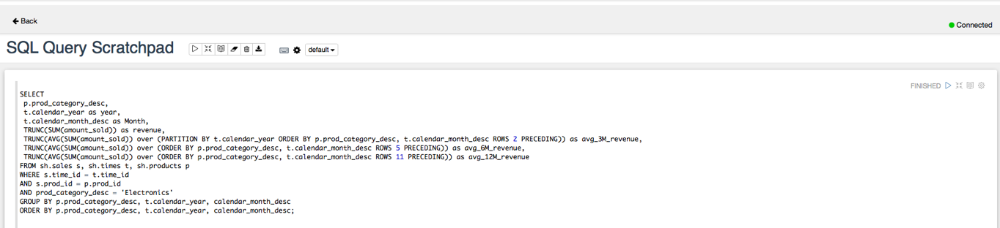

-   Press the icon shown in the red box to execute the SQL statement and display the results in a tabular format:

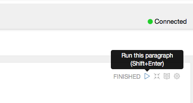

### Step 6: Changing the report type

-   Using the report menu bar you can change the table to a graph and/or export the result set to a CSV or TSV file.

-   When you change the report type to one of the graphs, then a **Settings** link will appear to the right of the menu which
    allows you to control the layout of columns within the graph.

-   Click on the **bar graph** icon to change the output to a bar graph (see below)

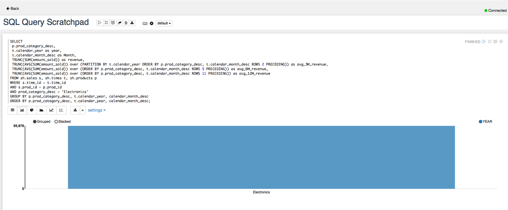

-   Click on the **Settings** link to unfold the settings panel for the graph.

-   To add a column to one of the **Keys**, **Groups** of **Values** panels just drag and drop the column name into the required panel.

-   To remove a column from the Keys, Groups of Values panel just click on the **x** next to the column name displayed in the relevant
    panel.

### Step 7: Changing the layout of the graph

-   With the graph settings panel visible:

    -   Remove all columns from the both the **Keys** and **Values** panels.

    -   Drag and drop **MONTH** into the Keys panel

    -   Drag and drop **REVENUE** into the Values panel

    -   Drag and drop **AVG\_12M\_REVENUE** into the Values panel

The report should now look like the one shown below.

### Step 8: Tidying up the report

-   Click on the **Settings** link to hide the layout controls.

-   Click on the **Hide editor** button which is to the right of the "Run this paragraph" button.

-   Now only the output is visible.

# Saving the Scratchpad as a New Notebook

## Steps

### Step 9: Saving the Scratchpad as a New Notebook

The SQL Scratchpad in the previous section is simply a default type notebook with a system generated name. But we can change the name of the scratchpad we have just created **SQL Query Scratchpad**.

-   Click on the **Back** link in the top left corner of the Scratchpad window to return to the OML home page.

-   Notice that in the **Recent Activities** panel there is a potted history of what has happened to your SQL scratchpad “notebook”.

-   Click on **Go to Notebooks** in the **Quick Actions** panel

-   The **Notebooks** page will be displayed:

-   Let’s rename our SQL Scratchpad notebook to something more informative. Click on text in the **comments** column to select
    the scratchpad so we can rename it. After you click, the “SQL Query Scratchpad” will become selected and the menu buttons above will
    activate.

-   Click on the **Edit** button to pop-up the settings dialog for this notebook and enter the information as shown in the image below
    (*note that the connection information is read-only because this is managed by Autonomous Data Warehouse Cloud*):

-   Click **OK** to save your notebook. You will see that your SQL Query Scratchpad notebook is now renamed to the new name you specified.

# Sharing notebooks

## Steps

### Step 10: Logging in to OML as the second OML (OMLUSER2) user

By default, when you create a notebook it’s only visible to you.

To make it available to other users you need to share the workspace containing the notebook. You can create new workspaces and projects to organize your notebooks for ease of use and to share with other users.

To demonstrate the sharing process let’s begin by logging in to OML as our second OML (OMLUSER2) user and checking if any notebooks are
available.

-   Click on your user name in the top right corner (**OMLUSER1**) and select “**Sign Out**”.

-   Now sign-in as OML user **OMLUSER2** using the password you entered at the beginning of this workshop:

Notice that you have no activity listed in the **Recent Activities** panel on your OML home page and you don’t have any notebooks.

-   Hint – click on the **Go to Notebooks** link in the **Quick Actions** panel:

-   Repeat the previous steps to logout of OML and sign into OML as **OMLUSER1**.

### Step 11: Changing Workspace Permissions

-   From the OML home page, click on link **OML Project (OML Workspace)** link in the top right corner on the OML home page to
    display the workspace-project menu. Then select **Workspace Permissions**.

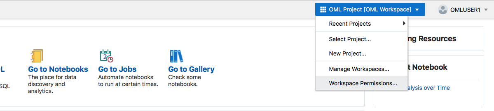

-   The permissions dialog box will appear (see below).

    -   In the dialog box next to the **Add Permissions** text type **OMLUSER2** (use uppercase).

    -   Set the permission type to **Viewer** (this means read-only access to the workspace, project and notebook).

-   **Note:**

    -   A “Developer” would have read-only access to the workspace, project but could add new notebooks, update and delete existing notebooks and schedule jobs to refresh a notebook.

    -   A “Manager” would have read-only access to the workspace, can create update and delete projects, add new notebooks, update and delete existing notebooks and schedule jobs to refresh a notebook.

-   Click the **Add** button to add the user **OMLUSER2** as a read-only viewer of the workspace. Your form should look like this:

-   Finally, click the **OK** button.

### Step 12: Accessing shared notebooks

-   Now repeat the process you followed at the start of this section and sign-out of OML and sign-in to OML again as user **OMLUSER2**.

-   First thing to note is that the **Recent Activities** panel below the **Quick Links** panel now shows all the changes user OMLUSER1
    made within the workspace OML-Workspace.

-   As user **OMLUSER2** you can now run the **Sales Analysis Over Time** notebook by clicking on **the blue-linked text** in the **Recent Activities** panel (*note that your recent activity will be logged under the banner labelled “Today”*).

-   The notebook will now open:

# Creating and running SQL scripts

## Steps

### Step 13: Getting Started with Scripts

-   Log out from user OMLUSER2 and log in as OMLUSER1.
The “Run SQL Statement” link on the home page allows you to run a single query in a paragraph. To be able to run scripts you can use the “Create a SQL Script” link on the home page.

-   On the OML home page click **Create a SQL Script** link within the **Quick Actions** panel.

-   A new **SQL scratchpad** will be created with the **%script** identifier already selected, this identifier allows you to run
    multiple SQL statements.

Notice that the script paragraph does not have any menus to control the display and formatting of the output. You can, however, use SQL SET commands to control how data is formatted for display.

### Step 14: Creating and running a SQL script 

In this section we are going to use a script from a SQL pattern matching tutorial, <a href="https://livesql.oracle.com/apex/livesql/file/tutorial_EWB8G5JBSHAGM9FB2GL4V5CAQ.html" target="_blank">Sessionization with MATCH\_RECOGNIZE and JSON</a>, on the free Oracle <a href="http://livesql.oracle.com/" target="_blank">livesql.oracle.com</a> site. This script shows how to use the SQL pattern matching **MATCH\_RECOGNIZE** feature for sessionization analysis based on **JSON** web log files.

-   Copy and paste <a href="./scripts/700/Sessionization_with_MATCH_RECOGNIZE_and_JSON.txt" target="_blank">this code snippet</a> into the **%script** paragraph. After pasting the above code into the script paragraph it should look something like this:

-   You can then run the script/paragraph and the output will appear below the code that makes up the script.

-   The result should look something like this:

-   You have completed all of the steps in this lab.

