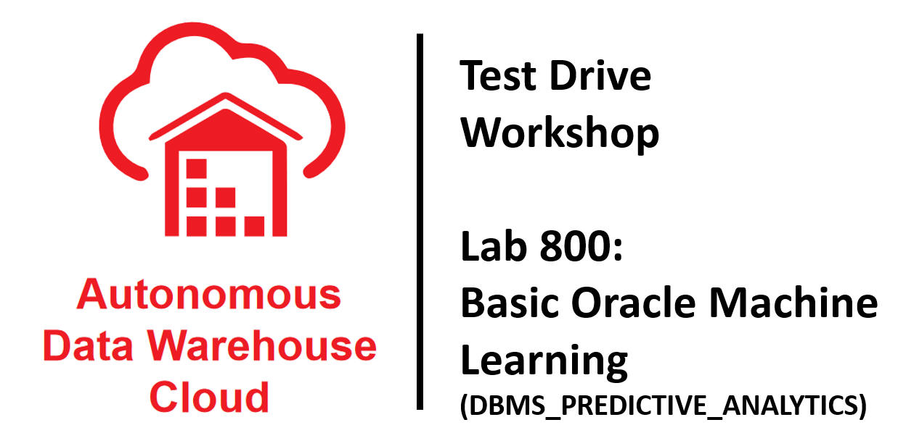
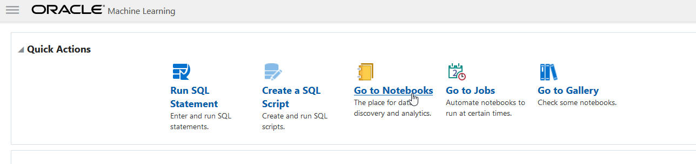
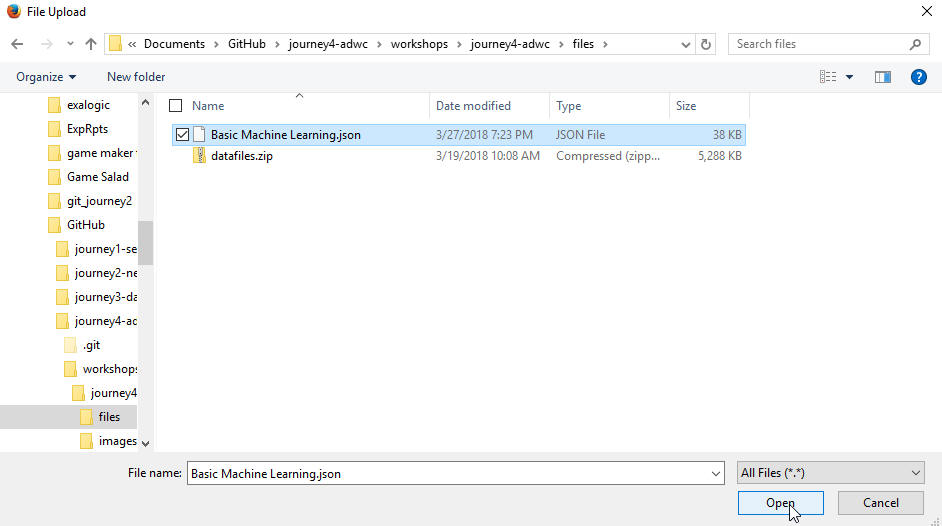

Updated: March 27, 2018

# Basic Oracle Database Machine Learning (DBMS_PREDICTIVE_ANALYTICS)

## Introduction

During this lab you will be using the Oracle Machine Learning (OML) notebook application provided with ADWC to explore some samples of the DBMS_PREDICTIVE_ANALYTICS functionality. DBMS_PREDICTIVE_ANALYTICS provides a set of easy-to-use machine learning procedures to simplify the machine learning process.

## Objectives

-   Learn how to import notebooks into Oracle ML Notebook
-   Learn how to use DBMS_PREDICTIVE_ANALYTICS routines

## Required Artifacts

-   The following lab requires a user with access to the Oracle Machine Learning Notebook application (note: you created such a user in the previous lab).

# Downloading and Importing the sample notebook

The first step is to download the sample notebook and then import it into the Oracle ML notebook application.

## Steps

### Step 1: Download the sample notebook for this lab

-   Download the sample notebook for this lab to a folder on your local computer from <a href="./files/Basic%20Machine%20Learning.zip" target="_blank">here</a>.

-   Note: the download is zipped and you will want to unzip it and copy the file in the zip to a known location on your computer.  After unzipping, you should have a file called "Basic Machine Learning.json".  Remember the location of where you have saved this file.

### Step 2: Login to the Oracle ML Notebook as one of your ML notebook users

-   In the previous lab, you created 2 users for the Oracle ML Notebook (omluser1 and omluser2).  Login to Oracle ML Notebook as one of those users.  Hint: the link to sign in to Oracle ML Notebook was sent to the email address you provided when you created the new users.

    

    

### Step 3: Click on the Go to Notebooks link

   

### Step 4: Click the Import button

   

### Step 5: Select the unzip lab notebook .json file you downloaded earlier

   

### Step 6: Click on the Basic Machine Learning link to open it

   

### Step 7: Read and Run the Basic Machine Learning notebook, paragraph by paragraph, to learn about using DBMS_PREDICTIVE_ANALYTICS
The notebook will provide some live examples of DBMS_PREDICTIVE_ANALYTICS in action against the sample SALES HISTORY tables.  There are additional instructions and steps in the notebook itself.

   

# Next Steps

- Experiment with DBMS_PREDICTIVE_ANALYTICS with your data
- Review the Oracle Database Data Mining documentation: https://docs.oracle.com/en/database/oracle/oracle-database/18/dmapi/introduction-to-oracle-data-mining.html
- Look at the DBMS_DATA_MINING sample notebooes in the Oracle ML Notebook Gallery