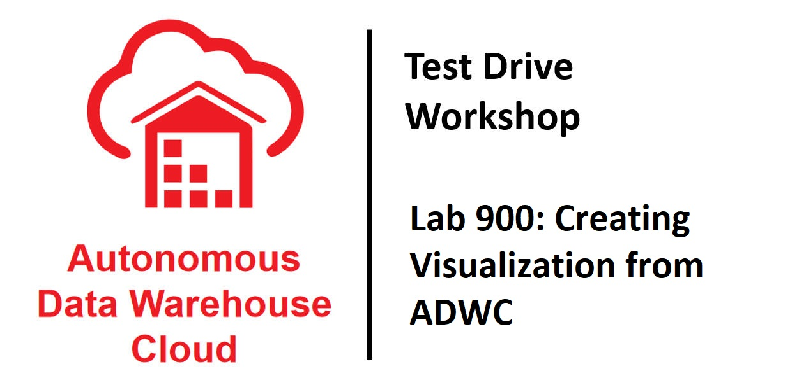

# Lab 900: Creating Visualization from ADWC

## Introduction

This lab will walk you through the steps to connect Oracle Data Visualization Desktop to an instance of ADWC.  Unlimited Data Visualization Desktop licenses are included when connecting to an ADWC data source.  Instructions will be provided to connect your previously created ADWC instance (using sample data loaded into data warehouse) to Oracle Data Visualization Desktop.  We will demonstrate how you can immediately gain insights and create beautiful data visualizations.

At this point, you should have performed the following:

   1. Created an ADWC instance and downloaded the credentials wallet.  

## Objectives
- Learn how to connect a desktop analytics tool to the powerful Autonomous Data Warehouse 
- Learn how to secure a desktop client connection to Autonomous Data Warehouse
- Learn how to create a simple data visualization project with Oracle Data Visualization Desktop
- Learn how to access and gain insights from data in the Autonomous Data Warehouse


## Required Artifacts
- Installation of Oracle Data Visualization Desktop
- Access to an ADWC instance 

## Set Up Local Windows Desktop Environment

### Installing Oracle Data Visualization Desktop on a Windows Desktop

- Downloaded the latest version of Oracle Data Visualization Desktop (DVD) from [here](http://www.oracle.com/technetwork/middleware/oracle-data-visualization/downloads/oracle-data-visualization-desktop-2938957.html).
- After saving the installer .ZIP to your desktop, open the compressed file and click on the .exe installer and follow the guided steps.

   

   

   

   

### Securing Your Client Connection to Autonomous Data Warehouse

You want to secure your data from the desktop all the way from the client application to the server where your data is stored.  Password credentials for connecting to databases can now be stored in a client-side Oracle wallet, a secure software container used to store authentication and signing credentials.  This wallet usage can simplify large-scale deployments that rely on password credentials for connecting to databases. When this feature is configured, application code, batch jobs, and scripts no longer need embedded user names and passwords. Risk is reduced because such passwords are no longer exposed in the clear, and password management policies are more easily enforced without changing application code whenever user names or passwords change.

- Go to the directory that you saved your credentials wallet file from the previous lab.  Open up the .ZIP file.

   
   

- Copy (extract or drag) two files to the wallet directory.

   - cwallet.sso
   - tnsnames.ora

- To secure the client communications between Oracle Data Visualization Desktop, we will copy the wallet to a location that Data Visualization Desktop expects.  In Windows, click on the Start menu and select Run….   

   

- Type ‘CMD’.  At the DOS prompt, navigate to the location where you extracted the files (cwallet.sso and tnsnames.ora).  I suggest that you cut the file location from an explorer window to the desktop.  It will save you typing in future steps.  The directions from here will show the steps as if you stored the wallet in the location c:\adw-wallet

- In the DOS window, type the command ‘cd c:\wallet’ and hit return to execute.  As a shortcut, type ‘cd ‘ and then do a right click to paste the text on the clipboard.  

- We will now copy the file cwallet.sso to the proper location for DV Desktop (%HOMEPATH%\AppData\Local\DVDesktop\components\OBIS\DWCS) to find.  Execute the command, 

   ```
   COPY cwallet.sso C:\%HOMEPATH%\AppData\Local\DVDesktop\components\OBIS\DWCS\
   ```

- Go to the directory and ensure that the file was copied over.  At the command prompt, type 

   ```
   CD C:\%HOMEPATH%\AppData\Local\DVDesktop\components\OBIS\DWCS
   ```
   and

   ```
   ‘DIR’
   ```

   


## Create the Data View in SQL Developer 

### Execute the Following Script in SQL Developer to Create a Data View 

For the sake of this test drive exercises, we are helping make it as simple as possible for you.  We don’t want the required steps of creating a data model required in any reporting, analytics or data visualization tool to overshadow the fact that Autonomous Data Warehouse is simple.  In this exercise, we are using the SH schema provided and will be creating a simple view.

- Go back to SQL Developer as you did in the previous exercises and connect to the ‘admin’ user.   Cut and paste and execute the following script.  

   ```
   drop view DV_SH_VIEW;

   create or replace view DV_SH_VIEW as select 
   P.PROD_NAME,
   P.PROD_DESC,
   P.PROD_CATEGORY,
   P.PROD_SUBCATEGORY,
   P.PROD_LIST_PRICE,
   S.QUANTITY_SOLD,
   S.AMOUNT_SOLD,
   X.CUST_GENDER,
   X.CUST_YEAR_OF_BIRTH,
   X.CUST_MARITAL_STATUS,
   X.CUST_INCOME_LEVEL,
   R.COUNTRY_NAME,
   R.COUNTRY_SUBREGION,
   R.COUNTRY_REGION,
   T.TIME_ID,
   T.DAY_NAME,
   T.CALENDAR_MONTH_NAME,
   T.CALENDAR_YEAR from
   SH.PRODUCTS P,
   SH.SALES S,
   SH.CUSTOMERS X,
   SH.COUNTRIES R,
   SH.TIMES T where
   S.PROD_ID=P.PROD_ID and
   S.CUST_ID=X.CUST_ID and
   S.TIME_ID=T.TIME_ID and
   X.COUNTRY_ID=R.COUNTRY_ID;
   ```

   

## Create a Connection to ADWC from Data Visualization Desktop

### Create a New Connection

- Start Oracle Data Visualization Desktop from the Start Windows Menu

   
   
   

- When Oracle Data Visualization Desktop opens, click on the ‘Create’ button and ‘Connection’ selection highlighted.

   

- In the Create Connection Dialog, select the highlighted option for ‘Oracle Autonomous Data Warehouse’ and start moving through the wizard.

   

- Go back to the directory where you saved your wallet file and extracted the file, ‘tnsnames.ora’.  Open the file and search for information that you will use to connect with.  I have provided an entry from the file as an example.

   ```
   kzengdw1_high = (description= (address=(protocol=tcps)(port=1522)(host=adwc.us-e1-1.oraclecloud.com))
   (connect_data=(service_name=tuak88quycc88vq_kzengdw1_high.adwc.oraclecloud.com))
   (security=(ssl_server_cert_dn="CN=adwc.us-e1.oraclecloud.com,OU=Oracle BMCS US,O=Oracle Corporation,
   L=Redwood City,ST=California,C=US"))   )
   ```
 
 
 
     | Connection Info       | Entry                                             |  
     | --------------------- | :--------------------------------------------- |
     | New Connection Name:  | Type in 'SALES_HISTORY'                             |
     | Host:                 | e.g. adwc.us-e1-1.oraclecloud.com (from above) |
     | Port:                 | 1522                                              |
     | Username:             | <your username> Insert username created in previous labs.  Same as SQL Developer credentials. |                                            
     | Password              | <your password> Insert username created in previous labs.  Same as SQL Developer credentials. | 
     | Service Name:         | e.g. tuak89quycc88vqkzengdw1high.adwc.oraclecloud.com (This information is also found in the ‘tnsnames.ora’ file. Example highlighted above.) |

- After completing the fields, click on ‘Save’ button.

   

- Upon success of creating a new connection to the Autonomous Data Warehouse, select the Create button and select Data Set.  

   
   
- We will now choose to select the sales data we want to analyze and visualize in our first project.  Select the connection we just created named SALES_HISTORY.

   
   
- Click on the ADMIN schema in the data warehouse.

   

- Select (Click) on DB_SH_VIEW.

   
   
- First click on the Add All Label in the left column, type a new Name for the Data Set called, ‘SALES_HISTORY’ and then Click on the Add button.  NOTE:  It is important to use the new name of ‘SALES_HISTORY’ as the rest of the lab exercises will reference that name.  Optionally, you can click on the “Get Preview” to see some example records.

   
   
- Once the SALES_HISTORY Data Set has successfully been created, click on the main menu item.

   
   
- Select the Data menu option on the left.  This should reveal your new SALES_HISTORY Data Set you created.  Right click on SALES_HISTORY label and choose the “Inspect” sub-menu item.

   
   
 - We are going to override the data types for two columns recognized as numeric and correctly set them as attributes-- CALENDAR_YEAR and CUST_YEAR_OF_BIRTH.  Hover the mouse over the names column looking for the fields, CALENDAR_YEAR.  Change the ‘Treat As’ field as an ‘Attribute’.  Repeat for the field, CUST_YEAR_OF_BIRTH.  When both field have been set to Attribute, click OK when done.  You will be promoted to confirm that you want to change the Data Set.  Confirm, ‘Yes’.

   
   
     
   
- Once the Data Set has been updated successfully, we are ready to create our first project.  Click on the Create Project button.

   
   
- Click on the SALES_HISTORY Data (highlight) and click on the ‘Add to Project’ button.

   
   
## Create a New Project in Oracle Data Visualization Desktop

### Introduction to the Project

No matter what your role is in the organization, access to timely data can provide greater insights to improve the performance of your business.  Whether you’re creating a data warehouse or data mart for yourself or others, Autonomous Data Warehouse Cloud is making it far simpler than ever before.  Easy, fast and elastic.   This small project demonstrates this.  This is how business users would interact with the Autonomous Data Warehouse.

SCENARIO:  For a moment, rewind yourself back a couple of decades.  You work at an electronics reseller company.  The founder started his business by selling camera and photography equipment.  He’s already diversified his business portfolio as he already owns many 1-hour photo processing and video rental stores.  Over the last few years, his computer reselling business has grown, but he’s not convinced that the PC/server business will last.  His instincts tell him to continue to focus on growing his photography equipment and supplies business rather than PCs.  If you had access to this technology and solution, what would this data tell him?  What insights could you share?  How could this data help him focus on the right investments, grow his business and better target his existing and potential customers?

### Browse Data Tiles

- We will first start by browsing the data that’s available in our Data Set. Click on the highlighted Prepare button and then click to select the menu option Data Tiles.  

   
   
   Notice how easy it is to browse the data elements to see what is available for you to further explore.  After scrolling through the data, click back on the highlighted Visualize option to bring up the blank canvas.  

   
   
### Create Your First Visualization

- We will now create a very simple visualization project to finish this lab.  Multi-select (ctrl+click) the 5 Data Elements within SALES_HISTORY including PROD_NAME, AMOUNT_SOLD, CALENDAR_YEAR, PROD_CATEGORY, and QUANTITY_SOLD.  

- Drag the five selected columns to the middle of the screen.
   
   
- Based upon this data, Oracle Data Visualization Desktop will choose a default visualization.  If not, choose the Scatter chart so it matches the view below.   

   
   
 At this point with a very few steps, you now have something that can further bring your data to life and begin to make some data-driven decisions.  And of course, as you share this with others, more and more people will want to gain access to the data.  But, don’t forget how easy, fast and elastic the Autonomous Data Warehouse is and will be able to quickly scale to meet your growing data and end users.
