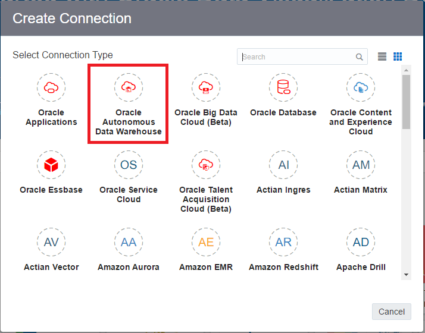
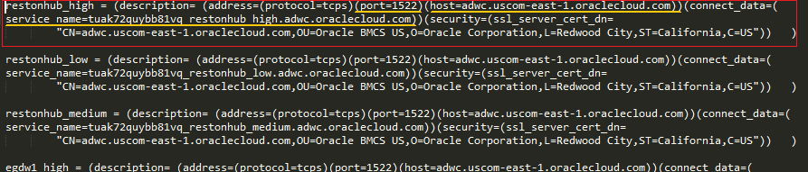
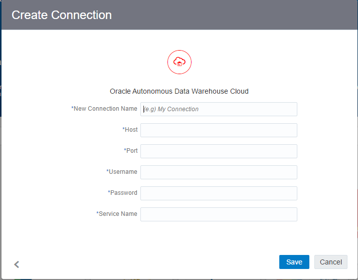
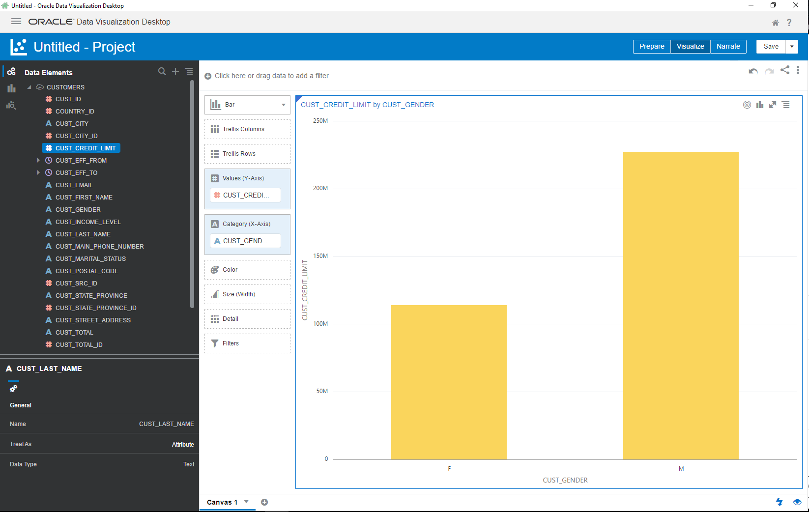
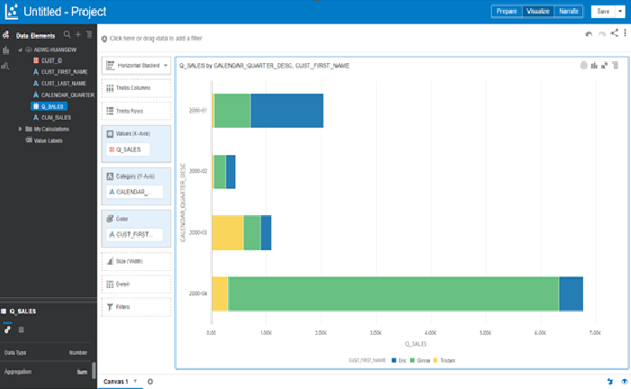

# Lab 900: Creating Visualization from ADWC

## Introduction

This lab will walk you through the connection of ADWCS to Data Visualization Desktop. This lab will elaborate on how you can connect your already created ADWCS instance (which has data already loaded into data warehouse) to DVD and perform beautiful visualizations in DVD.

At this point, you should have performed the following:
1. You have downloaded the latest version of Data Visualization Desktop (DVD) from [here](http://www.oracle.com/technetwork/middleware/oracle-data-visualization/downloads/oracle-data-visualization-desktop-2938957.html).

2. Existing ADWCS instance: You should create and launch the ADWCS instance. Note down the details such as host, service name and port number of your instance. These details will be required when connecting to DVD, more on this later.

## Objectives
- Set Up Local Environment
- Create New Data Visualization Desktop Connection
- Prepare Data Set and Create Visualization

## Required Artifacts

- Data Visualization Desktop
- An ADWC environment that you have access to
- This lab works only with Windows at this time.

## Set Up Local Environment

### Step 1: Set Up Local Environment

- Once you have the ADWCS instance up and running, you should have a wallet zip file from previous lab.

- Go to the directory that you saved your credentials wallet file from the previous lab. Open up the .ZIP file.
- Copy the cwallet.sso from unzipped folder to **C:\\%HOMEPATH%\AppData\Local\DVDesktop\components\OBIS\DWCS**. Note: Change **%HOMEPATH%** to your PC home path. 

    

## Create New Data Visualization Desktop Connection 

### Step 2: Create ADWC Connection

- Start DVD Version 4, Click on "Create" on top right of window.

  

- Click on Connection Icon. In Create Connection window, search data warehouse and click on Oracle Data Warehouse.

  

- On this window, you will need information from the tnsnames.ora file in the ADWC wallet folder. tnsnames.ora file can be obtained from wallet.zip.

- Find the service for you and copy the host, port, and service name to DVD 

  

- **Connection Name**: name for this connection
- **Host**: host name from tnsnames.ora for your service
- **Post**: port number from tnsnames.ora for your service
- **Username**: \<username>
- **Password**: \<password>

  

  Note: you can also connect as a user that has dwrole, like **dwuser** you created in lab 400. 

- Click on OK to save connection. If it says “Invalid Wallet file”, please follow step 2 to make sure the cwallet file is in the right folder. 

### Step 3: Create Data Set and Create Visualization

- Once the connection is saved, create a data set using that connection. 

  

- In this window, you can either select the columns you would like to visualize or just enter in a SQL statement.

- You can save the data set to create a new visualization project.

  
